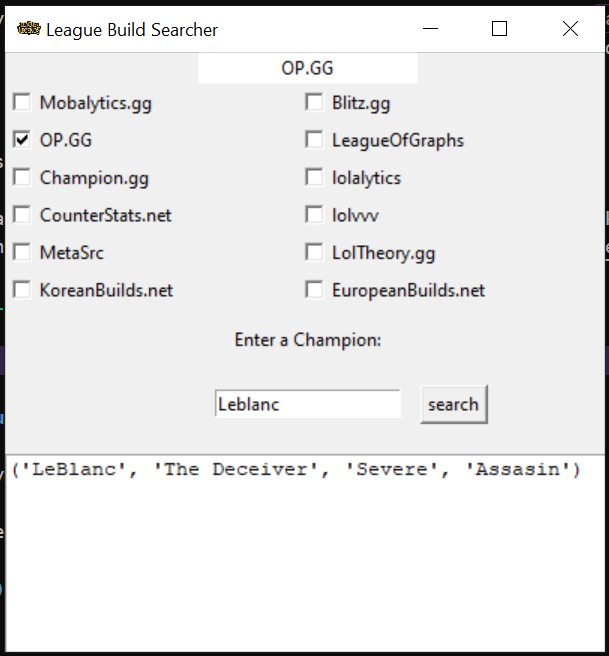

# League Champion Build App

## For what purpose does it exist ?

Have you never encountered problem for searching for runes or builds while in champ-select ? and you dont want to use a third party application because you run league of legends on a toaster ?

**League Champion Build App** is the perfect solution for these problems, it takes not a lot of space, very fast and user friendly.

## Dependancies

You should have `python 3.0 >=` installed, which normally comes with `tkinter` and `sqlite3`

## How to use it ?

To install, you can:
- install the zip file by clicking on **code**, then **download zip file**
- download by using [git](https://git-scm.com/): `git clone https://github.com/LelouchFR/league-champion-build-app.git`

Pretty easy to use, you can normally run it by **clicking on the file** `app.py` if you have a python launcher, else you can just go to the directory where you've put the application and run: `python3 app.py` and it will open the app.

After that, you just have to enter the name of champion you are searching for in the box which is displayed after the possible websites you can search informations on.

You can choose on what website it searches by simply clicking on the checkbox corresponding to your choice, by default it will go on [Mobalytics.gg](https://mobalytics.gg/lol?int_source=homepage&int_medium=header)

## How can I Contribute

You Can contribute by making it more efficient by creating you own branch of the repository.

Which could be updated is the silly goofy looking user interface, to make it more easier for user to use it.

## [License](./LICENSE)